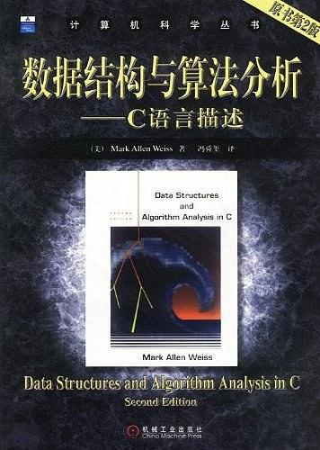
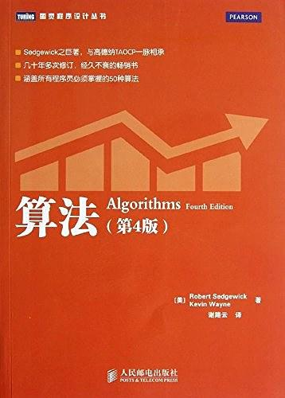

数据结构与算法分析
======================
`todo`
- 前期实现两本书上的基础数据结构+算法分析
- 长期更新加入其他高级算法(能力、时间范围之内)
- 作为本人学习算法的笔记, 供参考、讨论

`参考书籍`

 

- 算法分析
    - 时间复杂度
    - 空间复杂度
- 基础数据结构
    - [链表(LinkedList)](./docs/LinkedList.md)
    - [包(Bag)](./docs/Bag.md)
    - [栈(Stack)](./docs/Stack.md)
    - [队列(Queue)](.docs/Queue.md)
